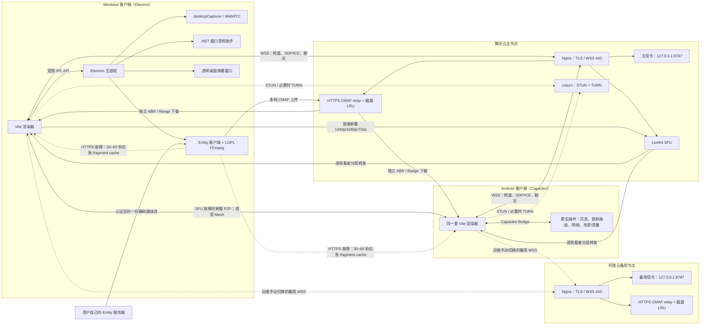

# “同频”项目完整说明

> - 适用版本：Native `2.9.2`
> - 面向读者：第一次接触本项目的产品、设计、测试、运维和开发人员
> - 最重要的入口：当前 Windows / Android 产品在 [`native/`](./native/)；仓库根目录还保留了一套独立的 VDO.Ninja 网页实现。

## 1. 先用一句话理解项目

“同频”让最多 8 个人进入同一个频道：Windows 成员可以选择电影窗口进行普通放映，
也可以让桌面程序直接读取 Emby 服务器的编码媒体流进行高清放映；其他 Windows 或
Android 成员本地解码观看，所有成员还能连麦和发弹幕。

系统刻意把不同流量分开：

- 普通屏幕画面与声音：优先由放映端上传一份多层流到腾讯云 LiveKit SFU，再按
  每位观看者的独立订阅档位分发；SFU 故障时回退到有总上行预算的 P2P/TURN。
- Emby：放映端生成共享时间轴的多档 CMAF，通过短期签名 HTTPS 上传；观看端各自
  ABR 下载和缓存。LiveKit/P2P 平时只传播放控制、房间时钟和清单刷新；HTTPS
  数据面连续失败时，指定观看端会临时启用部分可靠 P2P 媒体通道。
- 连麦语音：优先成员之间直连；复杂 NAT、公司网或代理环境下可以回退到 TURN。
- 频道状态、SDP/ICE、聊天文字：通过 WSS 信令服务器传递。
- 服务器不保存电影、声音或聊天历史，频道内存状态在最后一人离开后删除。

## 2. 仓库中其实有两套应用

### 2.1 `native/`：当前桌面与 Android 产品

用户提出的全屏、智能裁剪、画中画、弹幕、频道、连麦、窗口声音和 Android 功能都在这里。

它由四部分组成：

1. 一套 TypeScript/Vite 渲染器，同时运行在 Electron 和 Android WebView。
2. Electron 主进程，负责 Windows 窗口采集、系统桥接、透明弹幕层和打包。
3. Capacitor Android 外壳及原生插件。
4. Node.js WebSocket 信令服务器，以及配套的 Nginx、coturn、systemd/Docker 部署文件。

### 2.2 仓库根目录：独立的 VDO.Ninja 网页实现

根目录的 React/Next/vinext 应用通过 `https://vdo.ninja` iframe 完成浏览器窗口分享：

- `app/page.tsx` 生成随机流 ID，构造 VDO.Ninja 推流和观看 URL。
- 分享者把带 `?watch=...` 的网址发给朋友。
- `postMessage` 用于读取 iframe 的连接和媒体状态。
- `worker/index.ts` 是 Cloudflare/vinext Worker 入口。
- `.openai/hosting.json` 是该网页的 Sites 项目标识。

这套网页与 `native/` 的频道协议、信令服务器、频道码和窗口音频助手彼此独立。修改 Native 产品时，通常不需要改根目录网页；修改网页也不会自动进入 EXE 或 APK。

## 3. 总体架构



这里不使用数据库；媒体只进入受身份签名保护、按容量和 LRU 淘汰的临时分片缓存：

- LiveKit 是普通屏幕主链路；一位放映者发布显式 1440p/1080p/720p simulcast
  与独立 480p 应急轨，SFU 按观看者选择层并用 dynacast 停掉无人订阅的层。
- Emby 主数据面是 HTTPS CMAF；默认生产 1080p8/720p4，原画和 480p18 按真实观看
  需求启停。每位观看者自行 ABR、Range 重试与磁盘缓存，单个弱端不会改变全房间质量。
- 8 人全部连麦时，语音仍采用点对点 Mesh，每个成员最多连接另外 7 人。
- Node 服务器处理频道状态并签发临时 TURN、LiveKit 与 CMAF 凭据，同时保存有界、
  可淘汰的不可变 CMAF 对象；它不持有 Emby 令牌，不解析影片语义。
- LiveKit 建连、发布或运行失败时，客户端自动启用 P2P；严格 NAT 下可使用腾讯云
  TURN。阿里云不承载 STUN、TURN 或 LiveKit，但运行备用信令和只经 443 暴露的
  独立有界 CMAF 缓存。

## 4. 一次完整使用流程

### 4.1 启动与本机身份

`native/src/main.ts` 判断当前运行环境：

- Electron：可创建/加入频道，也可放映。
- Android：可加入频道、观看、连麦和聊天，不能发起窗口放映。

第一次创建频道时，`native/src/channel-store.ts`：

1. 在本机生成 32 字节随机 `ownerToken`。
2. 对它做 SHA-256。
3. 从摘要中取 40 bit，映射为不易混淆的 8 位频道码。
4. 把私有凭证写入本机 `localStorage`，只把频道码显示和分享给别人。

知道频道码并不能反推出 256 位私有凭证。服务器只在内存中保存凭证哈希，不保存明文凭证。

### 4.2 加入频道

客户端通过 `SignalClient` 连接 `/signal`，发送 `channel:join`：

- 频道主同时提交 `ownerToken`。
- 每个客户端提交随机 `resumeToken`，信令短断重连时可以保留参与者身份。
- Windows 提交 `canBroadcast: true`，Android 为只观看端。
- 服务器返回成员列表、当前放映者、画面能力和 ICE 服务器配置。

现代频道的管理权始终绑定创建者凭证。频道主离线后，普通成员不会自动继承踢人、禁麦等权限；创建者回来后恢复管理身份。

### 4.3 Windows 选择电影窗口

`native/electron/main.cjs` 通过 `desktopCapturer.getSources({ types: ["window"] })` 列出窗口，渲染器显示缩略图。

选中后：

1. Electron 记住来源 ID 和 Windows 窗口句柄。
2. 渲染器用 Electron 来源 ID 直接创建桌面捕获轨；兼容路径仍由
   `setDisplayMediaRequestHandler` 精确绑定到该窗口。
3. Windows 使用 125%/150% 等高 DPI 缩放时，客户端根据捕获轨的
   `screenPixelRatio` 重新以物理像素尺寸创建轨，避免把逻辑像素当成最终清晰度。
4. Chromium 直接产生原始视频轨，不经过 Canvas 重绘。

不走 Canvas 的原因：

- 硬件加速播放器更不容易黑屏。
- HDR/广色域信息尽可能留给 Chromium 和接收端完成色调映射。
- 不需要把弹幕烧进电影帧。

### 4.4 单独采集该窗口的电影声音

浏览器原生接口无法稳定做到“只采某一个 Windows 窗口所属进程的声音”，所以项目有一个 .NET 助手：

1. `native/audio-helper/Program.cs` 根据窗口句柄取得进程 ID。
2. NAudio 的 Process Loopback 以 `IncludeTargetProcessTree` 方式采集该进程树。
3. 输出固定为 48 kHz、双声道、16-bit PCM。
4. PCM 从助手的标准输出流进入 Electron。
5. Electron 通过 IPC 送给 `native/src/process-audio.ts`。
6. 渲染器中的 AudioWorklet 把 PCM 变成 `MediaStreamTrack`。
7. 该音轨与窗口视频轨一起放入电影 `MediaStream`。

这不会采集系统所有声音，也不会把“同频”自己的连麦声再次混入电影。受 DRM 保护的内容仍可能被 Windows 或播放器阻止。

### 4.5 建立电影 WebRTC

观看端先使用入房响应中的短期 LiveKit 凭据连接腾讯云 SFU；普通屏幕放映端向同一
房间发布显式 1440p/1080p/720p simulcast 和 480p 应急轨。观看端通过
`RemoteTrackPublication.setVideoQuality()`、`setVideoDimensions()` 与
`setVideoFPS()` 改变自己的订阅，不要求放映端重建全局流。只有 SFU 建连、发布
或运行失败时，观看者才发送 `broadcast:watch-ready`，放映端为至多两个故障观看者
创建有 1080p8/720p4 总预算的 P2P `RTCPeerConnection`。

可靠性措施包括：

- 每轮观看协商都有 `attempt` 和 `sessionId`；上一轮迟到的 SDP/ICE 会被丢弃。
- 首轮优先广泛具备硬件解码、并可在支持设备上硬件编码的 H.264 路径，失败后按
  VP9、VP8 轮换，避免某台设备只支持部分编解码器时一直黑屏。
- 发送码率按捕获轨的真实宽高与帧率计算；“原画”的 8K 约束只是上限，不再让
  普通 1080p30 窗口误用 32 Mbps。
- H.264/VP9/VP8 的 RTX、RED、ULPFEC 修复格式不会因编码排序而被禁用。
- 只有真正解码出第一帧后，观看端才发送 `media:ready`。
- 信令重连不主动销毁仍健康的 SFU 或 P2P 观看链路；回切 SFU 使用
  make-before-break，稳定 7 秒后才关闭 P2P。
- ICE 只接受可用的直连候选；虚拟网卡、TUN/VPN 和隐私化 mDNS 候选会按策略处理。
- 便携版可添加仅针对本程序的 Windows TCP/UDP 入站防火墙规则。

P2P 是普通屏幕故障备用而不是默认分发拓扑；直连失败时允许使用腾讯云 TURN。服务器不设置
静态媒体带宽上限，实际码率由端点能力、链路吞吐与 WebRTC 拥塞控制决定。

### 4.6 播放、统计和自适应

观看端在可用时从 `getStats()` 读取：

- 实际解码分辨率；
- 接收帧率；
- 当前码率；
- 编码器；
- 丢包、抖动和冻结增量；
- 解码耗时、接收端丢帧、软/硬件解码状态与实际抖动缓冲目标。

`native/src/adaptive-playback.ts` 把 network/encoder/decoder/render/transport
压力分别分类。严重丢包、buffer debt 或解码压力在 1–2 秒内降档；升档要求连续
稳定至少 20 秒、升级后保持 20 秒、可用带宽达到下一档约 1.5 倍，连续失败会延长
冷却。`detail` 内容优先保留像素，`motion` 优先保留帧率，`balanced` 取中间策略。
`getStats()` 超时只累计 telemetry missing：最多保留两个不可取消的 Chromium 原生
采样，连续 3/5 次才把统计置信度降为 reduced/missing；实际 HTML 视频帧、媒体时钟、
字节和 ICE 状态独立判断健康，统计失败本身不能触发重连。电影连接设置约 180 ms
的接收抖动目标，独立语音连接在直连时约 90 ms、中继时约 125 ms。

SFU 主线路把自适应结果直接应用到该观看者自己的订阅层；P2P 备用才修改对应
`RTCRtpSender`。发送端在正常状态下保持请求的物理分辨率；只有编码器持续报告
CPU 压力时才临时切到帧率优先，稳定后恢复。

### 4.7 Emby 高清播放

Windows 成员打开“开始放映”后可以在普通屏幕共享与 Emby 高清播放之间选择。Emby
模式完全不调用 `getDisplayMedia`：

1. `electron/emby-service.cjs` 用服务器地址、用户名和一次性密码调用
   `/Users/AuthenticateByName`；密码使用后立即清空且从不落盘。
2. `electron/emby-account-manager.cjs` 支持多个服务器/账户。访问令牌通过 Electron
   `safeStorage` 使用 Windows 系统凭据加密后保存在本机，使用时只在主进程解密；
   渲染器、信令服务器、SDP、房间成员和朋友客户端永远拿不到令牌，跨域重定向会
   删除全部 Emby 认证头。若系统加密不可用，账户只保留到本次程序退出。
3. 主进程可切换已保存账户；有搜索词时并发查询所有账户并合并、标注结果来源。
   随后读取所选服务器的媒体库并请求 `PlaybackInfo`。优先兼容原画/Direct Stream，
   再按需使用 Emby 转码；本机编码器按 NVENC→QSV→AMF→有界软件兜底探测。
4. 固定哈希的 FFmpeg 8.1 LGPL 独立程序从随机密钥的 `127.0.0.1` 回环代理读取
   媒体。代理的 AbortController 保持到正文结束，正文 15 秒无字节会真正中止，
   Range 请求按预算重试；停止时有界关闭现有连接和空闲连接。
5. `CmafRelayCoordinator` 生成共享时间轴、约 2 秒 GOP 对齐的多档媒体。默认只启动
   1080p8/720p4；桌面高速观看端需要时启动 original，持续弱网端需要时启动 480p18，
   无订阅 30 秒后正常停止可选 FFmpeg 并从服务表删除。再次有需求时使用新的 rendition
   epoch 从当前播放锚点启动；init 路径按 epoch 隔离，segment 使用跨重启单调递增的
   全局序号。所有辅助 FFmpeg 都由 `-readrate` 限速；共享上传 token bucket 最多使用
   测速后剩余上行的 65%。
6. 同一 rendition 的 init/segment 严格串行上传，不同 rendition 间最多三路并发。
   清单只公布 `contiguousUploadedSequence` 之前的连续前缀；单片三次短重试失败后进入
   独立的 1/2/4/8/15/30 秒抖动退避 actor，网络恢复不依赖令牌轮换。越过播放保留窗的
   失败片会安全回收，EOF 则先排空可用尾片再发布 rendition-local `ended`/最终序号。
7. 每次 `EmbyBroadcastController` 创建一个随机 `sessionId`。中继和本机 spool 路径均为
   `/media/v1/rooms/{room}/sessions/{sessionId}/assets/{assetId}/versions/{version}/…`，
   所以同一房间重播相同影片并从版本 1 开始也不会碰撞。服务端验证完整身份、连续序号、
   字节数与 SHA-256；不可变 PUT 使用锁内 exclusive link，竞争写不能覆盖已有对象。
8. 服务端以信令明确登记 active session，不再用最近访问时间猜当前版本。manifest
   同时携带发布端单调 revision、服务端 eviction revision 和逐档前缀 tombstone。
   活跃会话的 LRU 只允许裁剪播放点 30 秒以前的过期回看前缀，当前与所有未来分片、
   in-flight 新版本、init 和字幕均保持 pin；空间仍不足时用响应头要求发布端把前向
   窗口收敛到 120 秒。发布端下次 PUT 若仍引用已裁剪对象会收到结构化 409，先应用
   tombstone 或从本地 spool 补传缺失对象，再以新 revision 发布锚点和 ended，不能
   原样永久重试。观看端遇到 404 会刷新清单并从下一关键帧恢复。
9. `emby-segment-relay.ts` 在每位观看者本地执行 ABR：Urgent 负责未来 0–15 秒，
   Warm 负责 15–120 秒，Prefetch 仅在长期稳定、吞吐有 1.5 倍余量、RTT 稳定且非
   计费网络时运行。原画还必须同时满足前向缓存不少于 20 秒和实测吞吐不低于原画真实
   码率的 1.5 倍；P2P 可达性不会限制 HTTPS ABR。升级保护只禁止继续升档，不阻止降档。
10. 清单按缓冲状态在 400 ms–5 秒之间轮询并发送 `If-None-Match`；304 不重复解析，
    失败指数退避到 30 秒。客户端拒绝跨越超过 250 ms 的时间洞。seek/切档增加
    `fetchGeneration` 并取消旧请求；新档位只从对齐的真实关键帧接入。
11. 三级缓存职责分离：内存只留即将 append 的数据；CacheStorage 精确命中不等待
    全局扫描，LRU 元数据保存在 IndexedDB，至多 10,000 个旧键在后台迁移；`SourceBuffer`
    只保留播放点前少量和后方几十秒。QuotaExceeded 依次执行历史 trim、远未来 trim、
    abort、降低 buffer 和本地 MediaSource 重建，不能形成 trim-and-retry 活锁。
12. LiveKit/P2P 控制链切换只替换 control channel，保留 `EmbyMsePlayer`、ABR actor
    和已缓存媒体。连续三次 manifest/segment 请求失败时，观看端发送
    `segment-fallback-request`；即使它早于 `session-ready` 到达，主播也会暂存请求并在
    会话就绪后执行。主播用包含 session、mediaVersion、transportEpoch 的
    `segment-fallback-ack` 确认，观看端在 ACK 前按 500 ms/1 s/2 s 有界重发。媒体仅向
    该观看端启用部分可靠 DataChannel，并发送最近 30–60 秒主档缓存；连续三次 HTTPS
    探测恢复后释放应急链路并回到原 ABR 缓存。

成员在入房时就上报 MSE/H.264/HEVC/AAC 能力。默认选全员兼容的 H.264/AAC；只有
所有当前观众都支持时才允许 HEVC，晚加入的不兼容客户端会看到明确错误而不是黑屏。
当前版本支持最多 8 人。每位观看者独立选择 rendition，弱网端降到 720p/480p
不会降低其他人的原画/1080p，也不会重启全房间 FFmpeg/MSE。

Windows 观看端另有真实 WebGL2 GPU 空间增强后端：只在远端 Emby 360p–1080p
放大到接近 2K/4K、SDR、GPU 有余量时启用，使用视频纹理和五采样保守锐化，不做
CPU 回读；字幕与弹幕在增强后合成。GPU p95 超过 14 ms、丢帧超过 3%、资源压力、
上下文丢失或同机屏幕共享会自动关闭并冷却 30 秒；频道自适应模块判定的 decoder、
encoder、render 压力也会直接传入增强器统一让出资源。能力握手只声明实际后端；
仓库没有 NVIDIA RTX Video SDK 的授权二进制/运行时，因此当前不会宣称
`rtx-video`，但协议已为未来真实原生后端保留该枚举。

文本字幕 SRT/VTT/ASS/SSA 独立传输；PGS 等图片字幕不会自动触发不可见的本地视频
重编码。异常退出、停止放映和离开频道都会结束 FFmpeg、关闭回环代理并上报 Emby
停止会话，但保留系统加密的登录令牌以便下次快速使用；只有用户点击“移除此账户”
才会注销该 Emby 会话并删除本机令牌。

### 4.8 聊天与弹幕

客户端发送 `chat:send`，服务器清洗为最多 120 个字符，并加入：

- `messageId`
- `senderId`
- `nickname`
- `sentAt`

服务器限制每人 10 秒最多 8 条。

同一条消息有两种呈现：

- 右侧聊天记录：显示昵称、正文和右下角 `HH:mm` 时间戳。
- 电影弹幕：只显示昵称和正文，不显示时间。

播放器弹幕从画面最右侧之外进入。Windows 成员只要处于无人放映状态，无论是否
连麦，都会自动启用透明、点击穿透的全显示器桌面弹幕层；此时应用播放器内不再
重复显示。有人放映时则关闭桌面全屏层：放映者看到覆盖原播放器窗口的弹幕，
观看者看到应用播放画面内的弹幕。

## 5. 播放器与界面行为

### 5.1 桌面全屏

Windows 与 Android 进入全屏后沿用窗口状态的同一套居中播放工具栏，统一提供
播放、跳转、音量、弹幕、智能裁剪、聊天、画质、小窗和全屏控制，不再额外放置
右上角裁剪或右下角退出入口。鼠标移动或触摸时显示；停止操作 3 秒后工具栏、
进度条和鼠标光标一起隐藏。点击控件不会误触播放器。

### 5.2 小窗 / 画中画

Windows 放映端和观看端都在全屏按钮旁常驻显示“小窗模式”开关。开关本身始终可操作，
通过滑块位置、强调色以及“开/关”文字明确显示当前状态：

- 使用标准 `HTMLVideoElement.requestPictureInPicture()`。
- 点击开关只保存启用状态，不会立即打开小窗或最小化软件。
- 开启状态下，用户点击 Windows 标题栏最小化按钮时，Electron 先把当前本地预览
  或远端观看画面放入系统画中画，再最小化主窗口。
- 关闭状态下，最小化主窗口不会出现小窗。
- 关闭系统小窗会恢复主窗口；从任务栏恢复主窗口会自动关闭系统小窗。
- Electron 主窗口关闭 `backgroundThrottling`，最小化后 WebRTC、语音和 PiP 仍继续运行。

即使当前无人放映也可以预先开启开关；此时最小化仍会正常执行，只是没有可显示的
视频就不会生成空白小窗。只有系统 Chromium 本身不支持视频 PiP 时开关才会禁用。

### 5.3 智能裁剪

`native/src/video-presentation.ts` 对视频帧上下边缘取样：

1. 测量连续暗色行。
2. 确认画面中间确实有可见内容，避免把全黑镜头误判为黑边。
3. 收集多次测量，只采用时间上稳定的结果。
4. 计算居中缩放和垂直偏移，同时为字幕保留安全边界。

“包含”保留完整画面；“覆盖”直接铺满；“智能”只在检测到内嵌黑边时裁剪。

### 5.4 Android 手势

- 点击画面：显示或隐藏播放器控件。
- 左侧上下滑：调当前应用窗口亮度。
- 右侧上下滑：调 `STREAM_MUSIC` 音量。
- 全屏：原生锁定传感器横屏并隐藏系统栏，系统栏仍可通过边缘滑动临时唤出。

## 6. 连麦技术原理与本轮稳定性设计

### 6.1 语音网络拓扑

语音由 `native/src/voice.ts` 的 `VoiceMesh` 管理：

- 所有已连麦成员两两建立连接。
- 初次尝试允许 host/srflx 等直连候选。
- 连接失败后，如果服务器提供 TURN，则重建为 `relayOnly`。
- 每条语音协商有独立 `sessionId`。
- offer 碰撞按 polite/impolite 规则处理，必要时 rollback。
- Opus 使用 48 kHz 立体声协商、带 FEC、关闭 DTX；纯语音按降噪档位使用
  224–256 kbps，伴奏场景使用 256–320 kbps。

### 6.2 麦克风处理链

处理顺序如下：

```text
getUserMedia 麦克风
  → WebRTC AEC3 回声消除
  → 自然降噪：平台保真 NS
    / 清晰人声：平台 voice isolation + 人声频段增强
    / 强力消噪：DeepFilterNet3
  → 档位对应的高通、输入余量和动态压缩
  → -3 dB 防爆音限幅
  → MediaStreamDestination
  → RTCRtpSender
```

设计要点：

- 自然降噪把降噪和 AEC 留在 Chromium 的实时系统音频线程，保留环境与人声质感。
- 清晰人声启用平台语音隔离、2.8 kHz 人声增强和中等动态处理，适合日常连麦。
- 强力消噪使用 AudioWorklet 承载 DeepFilterNet3，避免渲染器卡顿饿死实时音频处理。
- DeepFilterNet3 启用时，浏览器自带 `noiseSuppression` 关闭，避免两次降噪产生金属音。
- 浏览器自动增益 AGC 默认关闭，靠固定增益、压缩和限幅防爆音。
- 已移除 100/120 Hz 双陷波和激进的 -18 dB、4:1 压缩，避免振铃、抽吸和底噪抬升。
- 强力模式才加载本地 DeepFilterNet3 模型；加载或运行失败时回到系统实时通话降噪。
- 模型、WASM 和运行时均随应用打包，连不上外网也可使用。

### 6.3 为什么会出现“刚连上，突然没声音”

单看 `bytesReceived` 不足以证明用户真的听到了声音。典型故障包括：

- AudioWorklet 内部抛错后，RTP 连接仍然正常，但处理节点此后永久输出 0。
- `MediaStreamTrack` 进入 `mute`/`ended`，PeerConnection 仍显示 `connected`。
- Android 或 Windows 切换蓝牙/扬声器时，原 `<audio>` 仍绑定旧路由。
- 页面隐藏、最小化或系统音频中断后，AudioContext 停在 `suspended`。
- 音频元素自动播放失败，或超过 100% 音量使用的 Web Audio 增益上下文被挂起。
- 双方都发 offer、旧 ICE 候选混入新一轮协商。
- 直连失败而服务器误下发了实际不可达的 TCP TURN。
- Android 没有取得 `USAGE_VOICE_COMMUNICATION` 音频焦点，其他应用短暂抢占后路由未恢复。

### 6.4 现在的恢复层

| 故障层 | 检测 | 自动处理 |
| --- | --- | --- |
| 强降噪工作线程 | `processorerror`；原始麦克风有能量但处理后连续为数字零 | 30 ms 交叉淡入独立直通支路，再后台重建为系统通话降噪 |
| 麦克风源 | source/processed track 的 `mute`、`ended`、AudioContext 状态 | 重新请求麦克风，并对所有 sender 执行 `replaceTrack` |
| 远端音轨 | `mute` 持续 4.5 秒、`ended` | 关闭失效 peer 并强制重新协商 |
| 远端播放元素 | `error`、`stalled`、`emptied`、意外 `pause`、错误 `srcObject` | 重绑远端流、重设 sink、取消静音并重新 `play()` |
| 放大播放图 | 增益 AudioContext 被挂起 | 尝试恢复；失败立即退回直接 `<audio>` 播放 |
| RTP 媒体 | 非“对方主动静音”状态下 12 秒无入站字节增长；刚取消静音时缩短为 5 秒 | 重建连接，首次失败后允许语音 TURN |
| 信令/成员状态 | 每 4 秒 `voice:sync` | 补齐缺失 peer；重发本机静音状态 |
| Android 系统路由 | 设备回调、音频焦点恢复 | 重新进入通信模式并重放用户选择的输出；设备消失则回到自动路由 |
| 窗口/页面恢复 | `visibilitychange` 与定时健康检查 | 恢复采集、播放上下文和所有远端音频 |

对方明确关闭麦克风时，系统记录 `microphoneMuted`，不会把“主动静音”误判为断流并不断重连。

### 6.5 借鉴和验证过的开源实现

本轮修复参考的是机制，而不是直接复制整套库：

- [WebRTC 官方 perfect negotiation 示例](https://github.com/webrtc/samples/blob/gh-pages/src/content/peerconnection/perfect-negotiation/js/peer.js)：offer 碰撞、polite peer 和 rollback。
- [LiveKit JS SDK 的 Room 实现](https://github.com/livekit/client-sdk-js/blob/main/src/room/Room.ts)：页面恢复时重新启动所有音频元素，以及周期性连接校验。
- [react-native-incall-manager Android 实现](https://github.com/react-native-webrtc/react-native-incall-manager/blob/master/android/src/main/java/com/zxcpoiu/incallmanager/InCallManagerModule.java)：语音通信 AudioAttributes、短时音频焦点和设备变化后的重新路由。
- [MDN AudioWorkletNode `processorerror`](https://developer.mozilla.org/en-US/docs/Web/API/AudioWorkletNode/processorerror_event)：处理器异常后节点会在其剩余生命周期中输出静音，因此必须有独立于故障节点的 fail-open 路径。

## 7. 信令服务器怎么连接

### 7.1 客户端地址

当前 Native 默认地址在 `native/src/config.ts`：

```text
wss://synced.com.cn/signal
```

阿里云 `wss://47.98.173.139/signal` 是运维手动选择的备用信令。旧的明文
`ws://47.98.173.139:8787` 会迁移到腾讯云主入口。生产地址必须使用受信任的 WSS；
Android Manifest 禁止任意明文网络。

### 7.2 公网请求路径

```text
客户端
  → TCP 443 / TLS
  → Nginx location /signal
  → ws://127.0.0.1:8787
  → native/server/index.mjs
```

Node 同时提供：

- `GET /healthz`：返回当前房间、客户端和容量摘要。
- `GET /readyz`：返回协议、8 人上限、SFU 和 relay 限制状态。
- `GET /capabilities`：返回协议、ICE、SFU 和节点能力。
- `GET /iceservers`：凭 Bearer token 刷新短期 TURN 凭据。
- WebSocket `/signal`：唯一的协议入口。

网络自检也复用 `/signal`，不会接受客户端提供的 URL、主机名或 IP：

- 入房前可发送 `network:probe`，按 `latency`、`upload`、`download` 三阶段逐片
  测量；v1 单片 32 KiB、每方向最多 512 KiB，v2 单片 64 KiB、每方向最多
  2 MiB，同时受整轮、单连接和源 IP 滑动窗口限流。
- 入房后客户端发送经过汇总的 `network:report`。报告只保存在当前 WebSocket
  会话内存中，五分钟失效，不进入成员广播、日志或持久化存储。
- 成员加入、离开或报告更新后，服务端分别向房间成员发送带单调 `revision` 的
  `network:advice`。建议只包含人数、置信度、单观看端带宽预算、推荐分辨率、
  各分辨率可选最大帧率和 `balanced` / `p2p-preferred` /
  `relay-preferred` 路线偏好；它不替用户选择帧率，也不会未经真实 ICE 结果强制中继。

### 7.3 STUN 与 TURN

STUN 用于发现公网映射；TURN 用于语音或电影 P2P 备用链路无法直连时转发媒体。
这些服务只运行在腾讯云主节点。

服务器可给 TURN 生成 4 小时有效的临时凭证：

```text
username = 过期时间戳:频道码
credential = HMAC-SHA1(TURN_SECRET, username)
```

客户端会在凭据剩余寿命约 30% 时刷新；只在 ICE 无法直连时使用 TURN。

### 7.4 生产端口

| 节点 | 端口 | 协议 | 用途 |
| --- | --- | --- | --- |
| 腾讯云 | 80/443 | TCP | ACME、HTTPS、WSS 与 `/sfu` |
| 腾讯云 | 3478 | TCP/UDP | coturn STUN/TURN |
| 腾讯云 | 7881 | TCP | LiveKit ICE/TCP |
| 腾讯云 | 7882 | UDP | LiveKit ICE/UDP |
| 腾讯云 | 32768–65535 | UDP | coturn relay |
| 阿里云 | 80/443 | TCP | 备用信令 TLS/WSS 与 CMAF HTTPS |
| 两节点本机 | 8787 | TCP | Node 信令，仅回环 |

阿里云不开放 UDP 443、3478、LiveKit 或 relay 端口。

### 7.5 关键环境变量

| 变量 | 含义 |
| --- | --- |
| `HOST` / `PORT` | Node 监听地址和端口 |
| `MAX_VIEWERS_PER_ROOM` | 每频道观看者上限；默认 7，加创建者共 8 人 |
| `MAX_CLIENTS` | 服务器总连接上限 |
| `MAX_CLIENTS_PER_IP` | 单 IP 连接上限 |
| `ICE_SERVERS_JSON` | 下发的 STUN/其他 ICE 服务器 |
| `TURN_URLS` | 逗号分隔的 TURN URL |
| `TURN_SECRET_FILE` | 与腾讯云 coturn 相同的共享密钥文件 |
| `TURN_TCP_ENABLED` | 是否允许向客户端下发 TCP TURN |
| `SFU_ENABLED` / `SFU_PUBLIC_URL` | 是否签发 LiveKit 凭据及其公网入口 |
| `LIVEKIT_API_KEY` / `LIVEKIT_API_SECRET_FILE` | LiveKit JWT 签发配置 |
| `SEGMENT_RELAY_SECRET_FILE` | 独立的 CMAF HMAC 签名密钥；不能复用 TURN/LiveKit secret |
| `SEGMENT_RELAY_CACHE_DIR` | 服务端 CMAF 磁盘 LRU 目录 |
| `SEGMENT_RELAY_DISK_BYTES` | 可选固定缓存上限；未设置时使用可用空间 4%、最高 5 GiB |
| `ALLOWED_ORIGINS` | 允许的 Electron/Capacitor/Web 来源 |
| `ALLOW_NO_ORIGIN` | 是否允许没有 Origin 的原生/测试客户端 |
| `TRUST_PROXY` | 是否只从受信的本机代理读取真实 IP |
| `ALLOW_LEGACY_PROTOCOL` | 是否允许旧 `host:create`/`viewer:join` 协议；生产应关闭 |

### 7.6 服务端安全边界

- WebSocket 最大消息 256 KiB，关闭压缩，减少压缩炸弹与资源滥用面。
- 网络探测每片最多 32 KiB、每方向每轮最多 512 KiB；每连接最多发起两轮，
  同一源 IP 每分钟最多八轮。
- 网络报告严格校验类型、范围与采样时间，单连接五秒内最多接受一次。
- 未在 30 秒内加入频道的连接被关闭。
- 心跳每 25 秒检查一次死连接。
- 每连接每分钟最多 360 条消息。
- 每人 10 秒最多 8 条聊天。
- SDP 最大约 196 KiB，ICE candidate 最大 4096 字符。
- 昵称、频道名、聊天均去控制字符、压缩空白并限制长度。
- `TRUST_PROXY=true` 时只信任来自回环反代的 `X-Forwarded-For`。
- coturn 拒绝把公网 TURN 当成访问私网、回环、CGNAT 或组播地址的代理。

## 8. 目录与文件说明

### 8.1 仓库根目录

| 路径 | 内容 |
| --- | --- |
| `.openai/hosting.json` | 根目录网页的 Sites 项目标识；当前没有 D1/R2 绑定 |
| `app/` | React/Next/vinext VDO.Ninja 网页界面 |
| `app/page.tsx` | 网页分享者/观看者的完整页面与 VDO.Ninja iframe 协议 |
| `app/globals.css` | 根目录网页样式 |
| `app/layout.tsx` | 网页 metadata、OG 信息和 HTML 外壳 |
| `app/chatgpt-auth.ts` | 可选的 Sites/ChatGPT 登录辅助；当前主页未依赖它 |
| `worker/index.ts` | Cloudflare Worker 与图片优化入口 |
| `public/` | 根目录网页 favicon、OG 图和示例 SVG |
| `db/` | 可选 Drizzle/D1 入口；schema 当前为空，Native 不使用 |
| `drizzle/` | Drizzle 迁移元数据 |
| `examples/d1/` | D1 示例，不在产品运行路径 |
| `tests/` | 根目录网页构建产物测试 |
| `build/sites-vite-plugin.ts` | Sites/vinext 构建辅助 |
| `package.json` | 根目录网页依赖与命令 |
| `vite.config.ts` / `next.config.ts` | vinext/Next 构建配置 |
| `native/` | 当前 Windows/Android 产品、信令和部署 |
| `.vinext/`, `.wrangler/`, `dist/`, `outputs/`, `work/` | 生成物或本地运行缓存，不是手写业务源码 |
| `node_modules/` | 根目录网页依赖，重新 `npm install` 可生成 |

### 8.2 `native/` 顶层

| 路径 | 内容 |
| --- | --- |
| `src/` | Electron 与 Android 共用的 TypeScript 渲染器 |
| `electron/` | Electron 主进程、预加载桥和透明弹幕窗口 |
| `android/` | Capacitor Android Gradle 工程与原生插件 |
| `audio-helper/` | Windows 按进程树采集音频的 .NET 9 工程 |
| `server/` | Node WebSocket 信令服务 |
| `deployment/` | Nginx、coturn、Docker、systemd、证书续签配置 |
| `scripts/` | 构建、发布、诊断、桌面/手机 E2E 和冒烟测试 |
| `test/` | Node 单元/协议测试 |
| `public/models/deepfilternet3/` | 随应用打包的 DeepFilterNet3 模型、WASM 和许可 |
| `vendor/brace-expansion-compat/` | 锁定的依赖兼容补丁 |
| `vendor/ffmpeg/` | 固定 SHA-256 的 FFmpeg 8.1 LGPL 运行时、许可和来源说明 |
| `build/` | NSIS 便携包/安装相关模板 |
| `.toolchains/` | 本地 JDK、Android SDK、.NET SDK；体积大且被 Git 忽略 |
| `dist-renderer/` | Vite 构建出的前端资源；生成物 |
| `release/` | EXE、APK、服务端 bundle 等交付产物；生成物 |
| `node_modules/` | Native JS 依赖；生成物 |
| `package.json` | Native 命令、Electron Builder 配置与版本 |
| `capacitor.config.ts` | Android App ID、名称和 `dist-renderer` 路径 |
| `vite.config.ts` | 共享渲染器构建配置 |
| `tsconfig.json` | TypeScript 严格检查配置 |

### 8.3 `native/src/` 逐文件

| 文件 | 责任 |
| --- | --- |
| `main.ts` | 首页、创建/加入入口、最近频道、深链和启动分流 |
| `channel-session.ts` | 最大的业务编排文件：频道 UI、放映、观看、全屏、PiP、逐端画质、故障切换与网络恢复 |
| `signal-message-scheduler.ts` | SDP/ICE 分片队列、可合并播放状态和不丢生命周期消息 |
| `sfu.ts` | LiveKit 生命周期、屏幕多层发布、逐观看者订阅、控制 DataTrack 与有界关闭 |
| `sfu-screen-policy.ts` | 1440p/1080p/720p/480p 的逐订阅端 quality/dimensions/FPS 映射 |
| `emby-broadcast.ts` | Emby 控制面、目标状态流控 actor、清单同步、跳转与会话上报 |
| `emby-segment-relay.ts` | 观看端 CMAF 清单校验、独立 ABR、三级缓存、Range 重试与 generation 取消 |
| `emby-transport.ts` | 控制协议、遗留 P2P 有界二进制传输、固定包头、CRC32 与能力检测 |
| `emby-player.ts` | fMP4 MSE 播放器、有界 Quota recovery、同步纠偏和文本字幕 |
| `video-enhancement.ts` | WebGL2 视频纹理空间增强、GPU p95/丢帧压力和自动冷却策略 |
| `room-companion.ts` | 成员列表、连麦控制、设备设置、聊天记录与时间戳 |
| `voice.ts` | 语音 Mesh、降噪图、协商、统计、设备/播放/断流恢复 |
| `rtc.ts` | SignalClient、PeerConnection 工厂、ICE 策略、SDP/Opus 调优、统计读取 |
| `process-audio.ts` | 把 .NET 助手 PCM 转成电影 Web Audio 音轨 |
| `deepfilter-noise-suppressor.ts` | DeepFilterNet3 AudioWorklet、本地模型路径和 bypass |
| `voice-processing.ts` | 麦克风 getUserMedia 约束，避免重复 AGC/降噪 |
| `adaptive-playback.ts` | 网络/编码/解码/渲染/传输压力分类，快降慢升与 detail/motion/balanced 阶梯 |
| `capture-resolution.ts` | Windows 高 DPI 逻辑像素到物理捕获尺寸的恢复计算 |
| `video-presentation.ts` | 黑边检测、稳定采样、智能居中裁剪和真实源尺寸格式化 |
| `playback-continuity.ts` | 判断信令重连时是否保留现有观看 PeerConnection |
| `playback-controls.ts` | Android 亮度和媒体音量桥 |
| `immersive.ts` | 浏览器 Fullscreen 与 Android 原生沉浸模式统一入口 |
| `audio-route.ts` | Android AudioRoute Capacitor 插件的 TypeScript 包装 |
| `native-network.ts` | Android 物理网卡地址和网络变化桥 |
| `platform-clipboard.ts` | Electron、Capacitor和浏览器剪贴板降级 |
| `danmaku-overlay.ts` | 播放器内弹幕 DOM、轨道与生命周期 |
| `danmaku-mode.ts` | 何时启用 Windows 桌面透明弹幕 |
| `channel-store.ts` | 频道主凭证、昵称、频道名和最近频道本地存储 |
| `config.ts` | 清晰度/帧率/码率、默认信令、邀请链接工具 |
| `global.d.ts` | Electron/Capacitor 暴露到 `window` 的类型 |
| `styles.css` | 全部共享界面、桌面/移动响应式和播放器样式 |

### 8.4 `native/electron/`

| 文件 | 责任 |
| --- | --- |
| `main.cjs` | BrowserWindow、权限、窗口列表、采集绑定、音频助手进程、防火墙、深链、资源协议、弹幕窗口 |
| `preload.cjs` | 通过 `contextBridge` 只暴露必要 IPC，不给渲染器 Node 权限 |
| `emby-account-manager.cjs` | 多服务器账户、Windows 加密持久化、账户切换与联合搜索 |
| `emby-service.cjs` | Emby 认证/媒体库/PlaybackInfo、正文空闲可取消代理、硬件编码探测、多档 FFmpeg/CMAF spool |
| `overlay.html` | 透明点击穿透桌面弹幕的动画和 DOM |
| `overlay-preload.cjs` | 只向弹幕页暴露消息/清空事件 |

Electron 保持 `contextIsolation: true`、`nodeIntegration: false`、`sandbox: true` 和 `webSecurity: true`。

### 8.5 `native/android/`

| 位置 | 责任 |
| --- | --- |
| `MainActivity.java` | 注册原生插件、硬件加速、保持亮屏、媒体免二次手势 |
| `AudioRoutePlugin.java` | 通信音频模式、AudioFocus、蓝牙/有线/扬声器选择和设备变化恢复 |
| `ImmersiveModePlugin.java` | 横屏与系统栏沉浸 |
| `NetworkBridgePlugin.java` | 识别物理网络和 IPv4，避免把 VPN/TUN 误当局域网 |
| `PlaybackControlsPlugin.java` | 应用窗口亮度和音乐流音量 |
| `NativeClipboardPlugin.java` | Android 剪贴板，仅写入邀请信息，不回读用户剪贴板 |
| `AndroidManifest.xml` | 网络、录音、音频设置、蓝牙权限与 `synced://join` 深链 |
| `network_security_config.xml` | Android 网络安全策略 |
| `app/build.gradle` | 版本、签名、SDK 与 APK 构建 |
| `res/` | 图标、启动图、主题和布局 |

### 8.6 `native/server/` 与 `native/deployment/`

- `server/index.mjs`：频道协议、临时 TURN/LiveKit/CMAF 凭证、限流、心跳、恢复和管理操作。
- `server/segment-relay.mjs`：身份绑定 manifest/object 校验、Range/CORS、内存/磁盘 LRU。
- `deployment/nginx-synced-signal-location.conf`：腾讯云信令、SFU、CMAF 和凭据刷新路由。
- `deployment/nginx-synced-standby.conf`：阿里云备用信令与 HTTPS CMAF 路由，不含 LiveKit/TURN。
- `deployment/docker-compose.yml`：腾讯云完整主节点部署。
- `deployment/synced-signal.service`：两节点共用的 systemd 信令服务。
- `deployment/synced-signal.env.example`：腾讯云环境变量模板。
- `deployment/synced-signal-hz.env.example`：阿里云备用信令模板。
- `deployment/99-synced-network.conf`：Linux 网络缓冲和 TCP 探测参数。
- `deployment/README.md`：运维部署的更细说明。

### 8.7 测试与脚本

单元/协议测试覆盖：

- 自适应画质分类、快降慢升、逐观看端 SFU 订阅隔离；
- 最近频道与频道主凭证；
- 弹幕模式；
- 健康观看连接保留；
- SDP 原型与序列化；
- 信令权限、恢复、人数、限流、TURN 下发；
- 信令 URL 迁移；
- 黑边检测和智能裁剪；
- 语音采集约束；
- 依赖兼容与安全。
- Emby 地址与重定向安全、媒体库/PlaybackInfo、真实 FFmpeg 重封装、MP4 时间轴；
- CMAF session 隔离、连续清单前缀、并发不可变 PUT、独立失败重试、active-session
  LRU、ETag/304、时间洞恢复、最终分片与 P2P 媒体应急链路；
- 遗留 DataChannel 固定包头、CRC、乱序重组、独立背压和 token bucket；
- MSE QuotaExceeded 终止恢复、信令分队列、流控 generation 与统计失败隔离；
- WebGL2 GPU 增强策略、p95/丢帧/冷却边界；
- Emby 能力字段的服务端清洗，确保密码/令牌不会进入房间状态。

重要冒烟脚本：

| 命令 | 验证内容 |
| --- | --- |
| `npm run smoke:voice` | 两人连麦、真实 RTP 音频能量、默认系统降噪、主线程阻塞不断音、DeepFilter 切换与长稳 |
| `npm run smoke:media` | 放映者到观看者的实际视频帧和 `media:ready` |
| `npm run smoke:emby` | 一份认证 Emby 流经 FFmpeg/CMAF、控制通道与 MSE 解码到 1280×720 |
| `npm run smoke:emby-ui` | 实际主窗口/IPC 登录、媒体库、选片、零屏幕捕获、本地播放、停止和令牌清理 |
| `npm run smoke:sidebar` | 成员/音量/管理、聊天时间戳、弹幕无时间、桌面播放器控件 |
| `npm run smoke:overlay` | 弹幕转义、动画和点击穿透 |
| `npm run smoke:desktop-danmaku` | 未连麦且无人放映时自动全屏、鼠标穿透、切换模式后隐藏清空 |
| `npm run smoke:window` | Windows 物理像素窗口采集、H.264 原分辨率编码/解码、持续帧率 |
| `npm run smoke:audio` | 按进程电影声音采集 |
| `npm run smoke:history` | 最近频道行为 |
| `npm run check:public` | 公网信令可用性 |
| `npm run check:public:security` | 公网信令安全策略 |

## 9. 最重要的代码在哪里

遇到需求时先看这张表：

| 要改的功能 | 首要文件 |
| --- | --- |
| 首页、创建/加入、最近频道 | `native/src/main.ts`, `native/src/channel-store.ts` |
| 播放器、全屏、PiP、智能裁剪 | `native/src/channel-session.ts`, `native/src/styles.css`, `native/src/video-presentation.ts` |
| 电影 WebRTC/ICE/码率 | `native/src/channel-session.ts`, `native/src/rtc.ts`, `native/src/adaptive-playback.ts` |
| Windows 选窗/高 DPI 原始分辨率 | `native/electron/main.cjs`, `native/electron/preload.cjs`, `native/src/capture-resolution.ts` |
| Windows 电影声音 | `native/audio-helper/Program.cs`, `native/src/process-audio.ts` |
| 连麦 | `native/src/voice.ts` |
| 默认通话处理/强降噪模型 | `native/src/voice-processing.ts`, `native/src/deepfilter-noise-suppressor.ts`, `native/public/models/` |
| Android 声音路由 | `native/android/app/src/main/java/com/synced/room/AudioRoutePlugin.java` |
| 聊天、时间戳、成员区 | `native/src/room-companion.ts` |
| 弹幕 | `native/src/danmaku-overlay.ts`, `native/electron/overlay.html` |
| 信令协议与权限 | `native/server/index.mjs`, `native/src/rtc.ts` |
| 服务器部署 | `native/deployment/` |
| EXE/APK 版本 | `native/package.json`, `native/android/app/build.gradle` |

## 10. 开发、构建与发布

### 10.1 环境

- Node.js 22 或更高。
- Windows EXE：Windows 10 2004+；构建音频助手需要 .NET 9 SDK。
- Android：JDK 21、Android SDK 和 Gradle Wrapper。
- 仓库的 `native/.toolchains/` 可放便携 JDK、Android SDK 和 .NET SDK。

### 10.2 Native 本地开发

终端一：

```powershell
cd native
npm install
npm run dev:signal
```

终端二：

```powershell
cd native
npm run start:electron
```

只调网页渲染器可用：

```powershell
npm run dev:web
```

### 10.3 检查

```powershell
npm run check
npm run smoke:voice
npm run smoke:sidebar
npm run smoke:overlay
npm run smoke:media
npm run smoke:emby
npm run smoke:emby-ui
```

`npm run check` 等于 TypeScript 检查、Node 测试、固定 FFmpeg 哈希/许可/能力检查
和 Vite 生产构建。

### 10.4 完整发布（每次可交付更新必须执行）

先同步提升 `native/package.json`、`native/package-lock.json`、Android
`versionName/versionCode`，再运行：

```powershell
npm run release:all
```

该命令依次生成 Windows 便携版、正式签名 Android APK 和信令服务 bundle，
并写出 `native/release/SHA256SUMS-<version>.txt`。Android 发布脚本会强制检查
版本一致性、Lint、正式证书指纹、v2/v3 签名、权限白名单、非调试构建、禁止备份
和禁止明文网络；任一检查失败都不会留下可交付 APK。

### 10.5 Windows

```powershell
npm run dist:portable
```

过程：

1. 编译 .NET 单文件音频助手。
2. 构建渲染器。
3. 执行完整检查。
4. 验证并打包独立的 FFmpeg LGPL 运行时。
5. Electron Builder 生成 `win-unpacked`。
6. 自定义 NSIS 脚本生成便携 EXE。

输出：

```text
native/release/windows-dist/Synced-<version>-portable.exe
```

### 10.6 Android

调试包：

```powershell
npm run cap:sync
cd android
.\gradlew.bat assembleDebug
```

正式签名包：

```powershell
npm run apk:release
```

正式脚本会自动寻找 `native/.toolchains/jdk/`；签名配置位于当前用户的 `.synced/signing/keystore.properties`，不得提交到 Git。

输出：

```text
native/release/android/Synced-<version>.apk
native/release/android/Synced-<version>-security.txt
```

### 10.7 根目录网页

```powershell
npm install
npm run dev
npm test
```

它构建的是 VDO.Ninja 网页，不是 EXE/APK。

## 11. 常见故障排查

### 11.1 能进频道，但电影一直没画面

依次检查：

1. 放映窗口是否仍存在且没有被 Windows 从采集源列表移除。
2. 观看端是否收到 `broadcast:started` 和 `signal`。
3. Electron 诊断日志中的 ICE candidate、offer 和首帧事件。
4. Windows 防火墙是否允许该便携 EXE 的 TCP/UDP 入站。
5. 代理/TUN 是否把物理局域网候选隐藏了。
6. LiveKit 是否连接成功；若已经回退 P2P，再检查腾讯云 TURN 是否可达。

### 11.2 有画面，没有电影声音

1. Windows 必须为 10 2004 / build 19041 或更高。
2. 确认选中的是实际播放窗口，不是启动器或封面窗口。
3. 电影播放器必须正在输出声音。
4. 检查 `Synced.AudioCapture.exe` 是否随包存在。
5. DRM 影片可能禁止系统采集。
6. 同一播放器的多窗口若共用进程，声音按进程树而非单个音频会话隔离。

### 11.2.1 Emby 高清模式无法播放

1. 确认这是 Windows 放映端；普通网页不能持有 Emby 令牌或启动本机 FFmpeg。
2. HTTP 地址只有勾选“允许可信局域网 HTTP”才会登录；公网建议始终使用 HTTPS。
3. 检查 NAS 只读账户是否有媒体库、播放和必要的服务器转码权限。
4. 选择 1080P/4K 限码却提示没有转码地址时，不要切回原盘绕过预算，应修复 Emby
   转码配置。
5. HEVC 仅在所有成员上报支持时启用；不兼容成员应改用最新版客户端或 H.264。
6. PGS 等图片字幕需改选文本字幕，或明确让 Emby 烧录转码。
7. 检查 `/media/v1/` manifest、init 和 segment 是否返回 200/206/304，路径与清单中的
   room/sessionId/asset/mediaVersion 是否全部一致，磁盘缓存目录是否可写。segment
   404 应先刷新 manifest；409 通常表示客户端错误复用了不可变对象键。
8. 运行 `npm run check:ffmpeg`、`npm run smoke:emby` 和
   `npm run smoke:emby-ui`，分别定位运行时、CMAF/MSE 数据面和实际 UI/IPC。

### 11.3 连麦先正常，随后静音

新版会自动恢复，但排查时仍应区分：

- `connectedPeers` 是否下降：网络/协商问题。
- `bytesReceived` 是否停止：ICE 或发送轨问题。
- `totalAudioEnergy` 是否增长：有 RTP 但实际是静音。
- 远端 track 是否 `muted/ended`。
- `<audio>` 是否 paused、error 或绑定了旧 `srcObject`。
- Android 当前通信输出是否仍是用户选中的耳机/扬声器。
- TCP TURN 是否在外网真实验证后才开启。

`npm run smoke:voice` 同时检查字节、包、音轨状态和实际音频能量，不能只用“连接成功”作为验收。

### 11.4 开启小窗后最小化没有画面

- 小窗模式仅出现在 Windows 桌面端，按钮应明确显示“开”或“关”。
- 必须先有本地放映预览或已经解码的远端画面；无人放映时不会创建空白小窗。
- 必须通过 Windows 标题栏最小化按钮触发；单击开关只改变启用状态。
- 系统必须支持标准视频 Picture-in-Picture。

### 11.5 Android 蓝牙不可选

蓝牙设备需要“附近设备”权限；拒绝后扬声器和有线耳机仍可使用。插拔设备后插件等待 180 ms 让系统路由列表稳定，再重选原输出；原设备消失时自动回退。

### 11.6 弹幕位置不对

- 播放器弹幕：检查 `native/src/styles.css` 的 `.danmaku` 和 `danmaku-fly`。
- Windows 桌面弹幕：检查 `native/electron/overlay.html`。
- 两处都应以 `right: 0` 加 `translateX(100%)` 从画面右边界外开始。

### 11.7 日志在哪里

Electron 诊断日志由 `electron/main.cjs` 写到：

```text
app.getPath("userData")/logs/portable.log
```

超过 2 MiB 会轮换为 `portable.log.previous`。日志记录来源选择、音频助手、P2P 协商、ICE、首帧和失败原因，不记录电影内容。

服务端用 systemd 时看：

```bash
journalctl -u synced-signal -f
journalctl -u synced-livekit -f  # 仅腾讯云
journalctl -u coturn -f           # 仅腾讯云
```

## 12. 修改时必须守住的约束

1. 保持 LiveKit SFU 为普通屏幕主链路、P2P/TURN 为有预算的故障备用；Emby 正常
   数据面必须走签名 HTTPS CMAF，仅在中继连续失败时为单个观看端临时启用部分可靠
   P2P 媒体应急通道。阿里云只能运行 443 上的备用信令/分片缓存，不能部署 LiveKit、
   TURN 或额外媒体端口。
2. 不要重新用 Canvas 合成电影画面和弹幕，会重新引入黑屏、HDR 和性能问题。
3. 不要在渲染器打开 Node 集成；系统能力必须通过窄 IPC/Capacitor API。
4. 不要把频道主私有凭证、Android 签名文件或 TURN secret 提交到 Git。
5. 新增信令消息时同时更新客户端类型、服务端清洗/权限和协议测试。
6. 音频验收必须看实际能量或听感，不能只看 PeerConnection 为 `connected`。
7. 设备变化、页面隐藏、信令重连和旧协商消息都必须按可恢复事件设计。
8. 改播放器时同时验证桌面、Android、全屏、智能裁剪和弹幕层级。
9. 每次可交付更新都必须提升版本，同步 `native/package.json`、
   `native/package-lock.json` 和 Android `versionName/versionCode`，并以
   `npm run release:all` 重新生成 EXE、APK、服务 bundle 与 SHA-256 清单。
10. 部署前分别验证腾讯云 WSS/SFU/STUN/TURN/CMAF 和阿里云 WSS/CMAF；阿里云
    不得出现 3478、UDP 443、LiveKit 或 relay 监听。

## 13. 新人建议阅读顺序

如果只想快速接手，按下面顺序读：

1. 本文第 1–7 节，先建立整体模型。
2. `native/README.md`，了解当前产品边界和部署摘要。
3. `native/src/main.ts`，看应用怎么进入频道。
4. `native/src/channel-session.ts` 的 DOM 模板、观看/放映和消息处理。
5. `native/src/rtc.ts`，理解 P2P、候选过滤与统计。
6. `native/src/voice.ts`，理解独立的语音 Mesh。
7. `native/server/index.mjs`，沿 `message.type` 逐个看协议。
8. `native/electron/main.cjs` 和 Android 插件，理解系统能力边界。
9. 先跑 `npm run check` 和四个核心 smoke，再开始改动。

## 14. 术语表

| 术语 | 含义 |
| --- | --- |
| SDP | WebRTC 对媒体、编码、网络参数的描述 |
| ICE | 搜集并尝试可达网络路径的框架 |
| host candidate | 本机网卡地址 |
| srflx candidate | STUN 发现的公网映射地址 |
| relay candidate | TURN 中继地址 |
| STUN | 帮客户端发现公网地址，本身不转发媒体 |
| TURN | 直连失败时转发媒体 |
| WSS | TLS 加密的 WebSocket |
| P2P | 媒体直接在两台客户端间传输 |
| Mesh | 每位语音成员与其他成员两两连接 |
| AEC | Acoustic Echo Cancellation，回声消除 |
| AGC | Automatic Gain Control，自动增益 |
| DeepFilterNet3 | 更重的全频段神经降噪模型 |
| AudioWorklet | 浏览器实时音频工作线程 API |
| PiP | Picture-in-Picture，系统画中画小窗 |
| `media:ready` | 观看端真正解码第一帧后的确认，不等同于仅收到 track |

读完本文后，新成员应能回答三件事：媒体是否经过服务器、某项功能在哪个文件、发生黑屏或静音时先检查哪一层。
